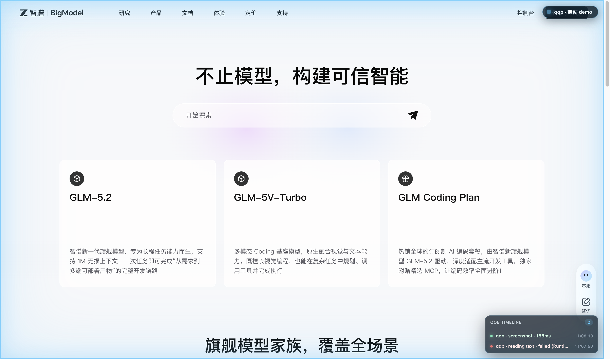
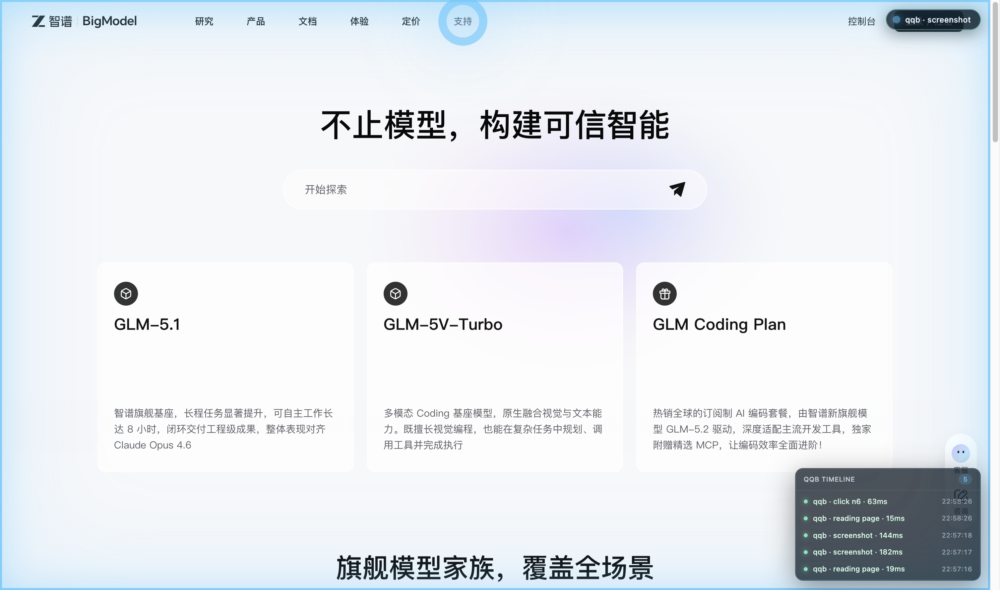
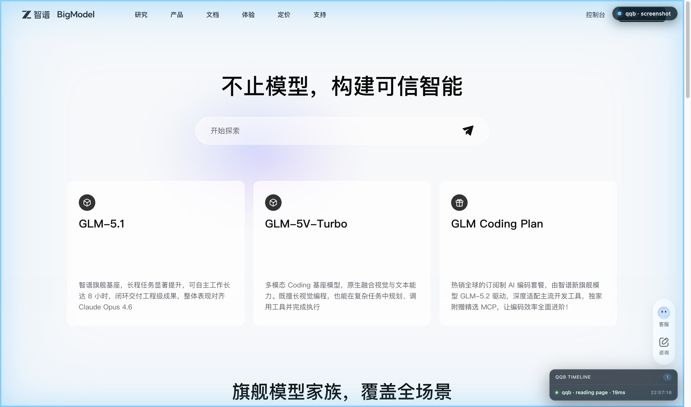
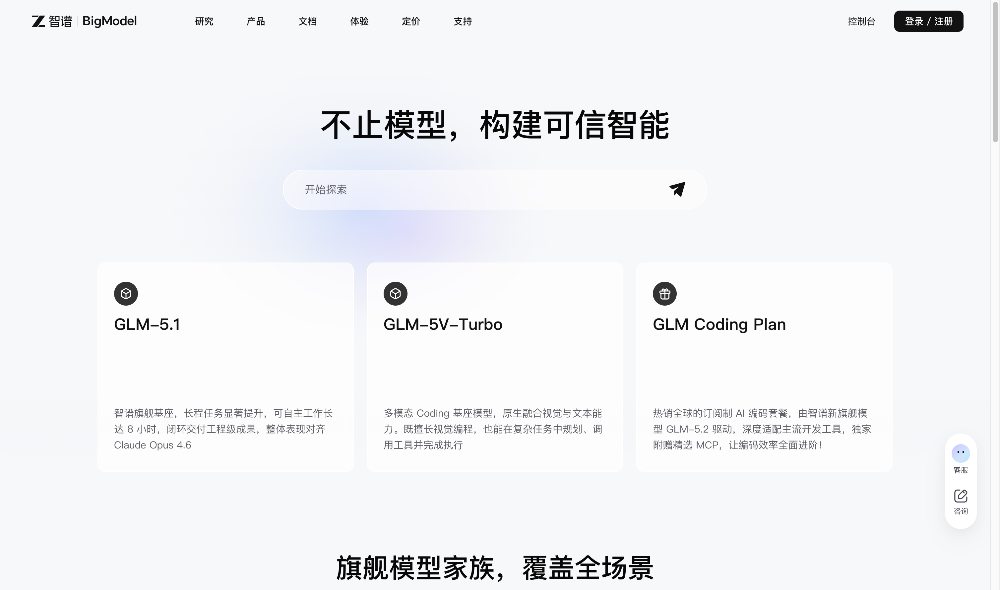

# qqb-cc-bridge

[](./LICENSE)
[](./extension/manifest.json)
[](https://browser.qq.com/)
[](#limits--known-issues)
[](./bridge/package.json)

> Drive **QQ Browser** from **Claude Code** — read pages via the Accessibility Tree, click & type via CDP, screenshot on demand. One long-lived daemon, one Bash CLI, zero MCP plumbing.

<video src="https://github.com/Lazarus893/qqb-cc-bridge/raw/main/docs/qqb-demo.mp4" controls></video>

[Watch the 10-second demo](./docs/qqb-demo.mp4) (clean → breathing pulse → click ripple → command timeline → clean again).

## Why

LLM coding agents are great at reasoning about code, but blind to the rest of the operator's desktop. A web page is a hostile place to drag a model through: HTML is verbose, CSS selectors are brittle, screenshots burn tokens, and Chrome-flavored automation stacks (Playwright, Puppeteer, MCP browser servers) all want their own runtime, their own protocol, and their own permission dance.

`qqb-cc-bridge` is the smallest thing that gives **Claude Code** direct, low-token access to whatever page is open in **QQ Browser**. The model reads pages through the **Accessibility Tree** — same data a screen reader sees, ~10–20× cheaper than HTML — and acts through **CDP** synthetic input (`isTrusted: true`) so login forms, search boxes, and SPA routers all believe the user typed it. A breathing cyan overlay paints itself on the page during every action, so the human watching always sees what the agent just touched.

We picked a **Bash CLI over an MCP server** on purpose. MCP gave each Claude Code session its own process fighting over port 9528 and broke composition with `jq`/pipes/redirects. The CLI is one-shot: auth → request → JSON to stdout → exit. The Skill teaches Claude how to chain it.

## Demo

| | |
|---|---|
|  | **Breathing overlay** — soft cyan pulse + label pill announces the agent is reading the page. |
|  | **Click ripple** — every CDP-synthesized click flashes a focused ring on the target nodeRef. |
|  | **Command timeline** — recent `qqb` calls scroll up the side of the page like a tiny activity log. |
|  | **Clean state** — the overlay self-clears after idle, and `--clean` snapshots strip it for archival shots. |

## Architecture

```
   ┌─────────────────────┐    ┌──────────────────────┐    ┌──────────────────────┐
   │ Claude Code session │    │  bin/qqb.js (CLI)    │    │ daemon (long-lived)  │
   │ Skill: qqb-bridge   │───▶│  one-shot: auth →    │───▶│ src/index.js         │
   │ Bash composition    │    │  request → stdout    │ WS │   ├─ WS server :9528 │
   └─────────────────────┘    └──────────────────────┘    │   └─ tab/event hub   │
                                                          └──────────┬───────────┘
                                                                     │ WS
                                                                     ▼
                                                          ┌──────────────────────┐
                                                          │ QQ Browser extension │
                                                          │ Manifest V3 + SW     │
                                                          │ chrome.debugger      │
                                                          └──────────┬───────────┘
                                                                     │ CDP
                                                                     ▼
                                                          ┌──────────────────────┐
                                                          │ Active tab (page)    │
                                                          │ AX tree, DOM, input  │
                                                          │ + breathing overlay  │
                                                          └──────────────────────┘
```

The daemon is the only stateful piece — it owns `ws://127.0.0.1:9528`, holds the auth token, and routes JSON requests between any number of CLI invocations and exactly one connected extension. The CLI is stateless: it auths, sends one request, prints JSON, exits. The extension attaches `chrome.debugger` to the active tab on user gesture, then proxies CDP calls back over the WebSocket.

## Quick start

### 1. Install + run the daemon

```bash
cd bridge
npm install
node src/index.js          # leave running; first boot prints + saves the auth token
```

The daemon writes a token to `~/.qqb-cc-bridge/token`. Keep it; you'll paste it into the extension.

Optional: symlink the CLI onto your PATH.

```bash
ln -s "$PWD/bin/qqb.js" ~/.local/bin/qqb
```

### 2. Load the extension into QQ Browser

1. `qqbrowser://extensions` → 开发者模式 → 加载已解压的扩展程序
2. Pick the `extension/` directory in this repo
3. Click the extension icon → popup
4. Paste the token from `~/.qqb-cc-bridge/token`, click **save & reconnect** — the dot turns green
5. On the tab you want Claude to control, click **接管当前页** (this attaches `chrome.debugger`; QQ Browser will show its standard yellow consent bar)

### 3. Wire the Skill into Claude Code

```bash
mkdir -p ~/.claude/skills
cp -r skill ~/.claude/skills/qqb-bridge
```

### 4. Try it

```bash
qqb ping --pretty
qqb tabs --refresh true --pretty
qqb snapshot --pretty | jq '{title, url, nodeCount}'
qqb screenshot --pretty
```

In Claude Code, say:

> 用 qqb 看一下当前页面，先 ping 再 tabs 再 snapshot

## Tools

All commands print JSON to stdout. Pipe through `jq` for slicing.

| command | what |
|---|---|
| `qqb ping` | Health check. Returns `{mcpAlive, daemonReachable, extensionConnected, tabs}`. |
| `qqb tabs` | List all tabs the extension knows about. `--refresh true` to re-enumerate. |
| `qqb snapshot` | AX-tree snapshot of a tab. **Use BEFORE clicking/typing.** `--mode ax`, `--maxNodes 800`. |
| `qqb read` | Reader-mode `innerText`. Cheaper than snapshot when you only need to read. |
| `qqb screenshot` | PNG/JPEG of viewport / `--fullPage` / `--ref nX`. Writes to `/tmp/qqb-screenshots/`, returns path. `--clean` strips overlay; `--quiet` suppresses meta. |
| `qqb click <nodeRef>` | Click an element by nodeRef. `--button left\|right\|middle`, `--clickCount N`. |
| `qqb type <nodeRef> --text "…"` | Type into an input. `--clear true\|false`, `--submit true\|false`. |
| `qqb scroll` | Scroll viewport (`--direction up/down/top/bottom`) or scroll element into view (`--ref nX`). |
| `qqb navigate <url>` | Drive a tab to a URL. `--waitUntil load\|domcontentloaded\|networkidle`, `--newTab`. |
| `qqb wait` | Wait for `--idle MS` / `--url-changes [FROM]` / `--url-matches PATTERN` / `--selector SEL` / `--no-selector SEL`. |
| `qqb exec '<expr>'` | **Escape hatch** — eval JS in the tab. Prefer snapshot/read first. |
| `qqb pulse` | Manually trigger/clear the breathing overlay. `--label "…"`, `--duration N`, `--stop`, `--destroy`. |
| `qqb takeover` | Attach `chrome.debugger`. Requires user gesture; surfaces yellow consent bar. |
| `qqb release` | Detach `chrome.debugger`. |

Run `qqb --help` for the full flag set.

The Skill teaches Claude the pattern: **snapshot first → reason about role+name → click by nodeRef → re-snapshot → screenshot only when AX is insufficient.**

## Wire protocol

JSON over WebSocket, both directions:

| message | sender → receiver | when |
|---|---|---|
| `{type:'auth', token, role}` | client → daemon | first message; role ∈ `extension` \| `mcp-client` |
| `{type:'auth-ok'}` | daemon → client | handshake complete |
| `{id, type:'request', method, params}` | mcp-client → daemon → extension | tool call |
| `{id, type:'response', result \| error}` | extension → daemon → mcp-client | reply |
| `{type:'event', event, data}` | extension → daemon → all mcp-clients | tab list pushes etc. |

### How page info is captured

Three channels, in order of preference:

1. **AX tree** (main path) — `chrome.debugger` + `Accessibility.getFullAXTree`, folded into a token-friendly tree with stable `nodeRef`s. Covers ~70% of real pages.
2. **DOM `innerText`** — `qqb read`, reader-mode body text. For pure article reads.
3. **Screenshot** — `qqb screenshot`, CDP `Page.captureScreenshot`. Covers the visual gap (canvas apps, icon-only buttons, layout/overlap, error states).

CDP returns base64; the CLI writes it to disk and returns just the path so multi-MB images don't end up in the LLM's context window.

### Permissions

The extension requests:

| permission | why |
|---|---|
| `debugger` | the only way to read AX tree + dispatch trusted input events |
| `tabs` | enumerate tabs |
| `scripting` | reserved fallback channel |
| `activeTab` | resolve "current tab" without per-tab prompts |
| `storage` | persist bridge URL + token |
| `<all_urls>` host | required for `chrome.debugger` to attach to any site |

`chrome.debugger.attach` requires explicit user consent every time (the yellow banner). The Skill never auto-attaches — `takeover` is reserved for popup buttons.

## Limits & known issues

Honest list of what doesn't work yet:

- **Single extension client.** Latest WS connection wins. No multi-browser fan-out.
- **Main frame only.** Cross-origin iframes are not in the AX snapshot yet.
- **No DOM-mode snapshot fallback.** Sites built on raw `<div>` soup with no ARIA roles are unreadable through AX.
- **MV3 service-worker eviction.** QQ Browser may evict the extension's background worker after long idle; reconnect is automatic but the active CDP session is lost.
- **CDP transient errors.** `Target closed`, `Cannot find context with specified id` happen during navigation — currently surfaced raw, no auto-retry.
- **Captcha / 行为验证 / risk pages.** Bot-detection layers that go beyond `isTrusted` are out of scope.
- **`chrome.debugger` cannot attach** to `qqbrowser://`, `chrome://`, or the Chrome Web Store.
- **No Shadow DOM closed-root** support.
- **Token in plain text** at `~/.qqb-cc-bridge/token` (mode 0600). Local-only by design — daemon binds to `127.0.0.1`.

See [CHANGELOG.md](./CHANGELOG.md) for what's shipped and what's in progress.

## License

MIT — see [LICENSE](./LICENSE).
